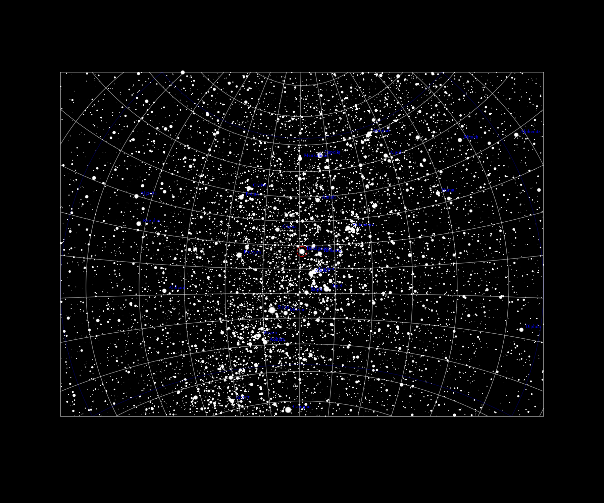
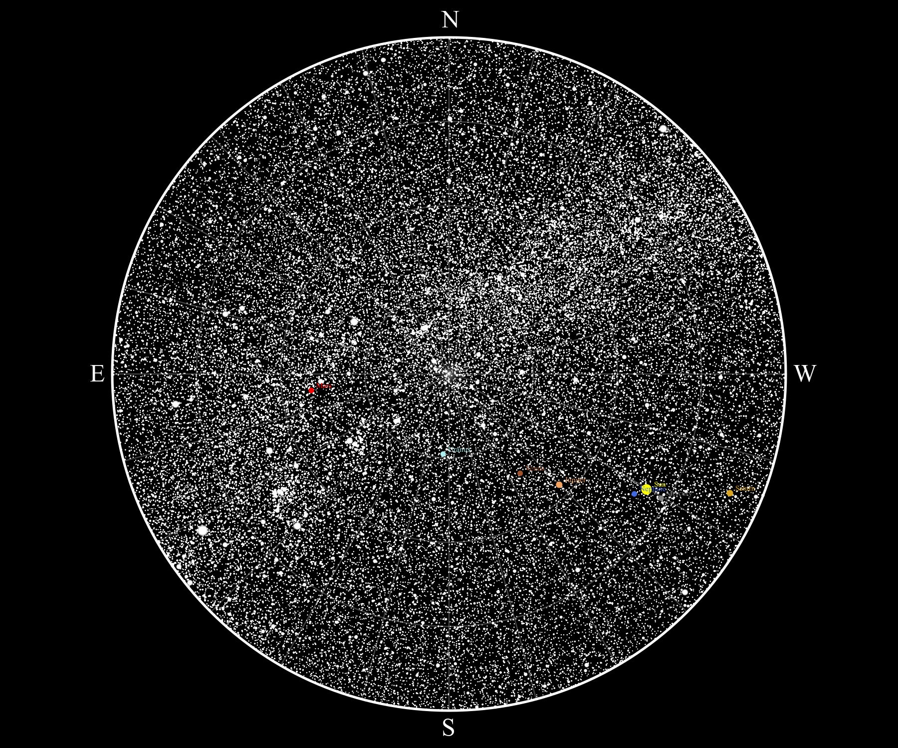

# StarMap
StarMap is an in-progress project that will accept an observing plan from an astronomer and generate finder charts through an easy to use GUI. 
It also has functionality to generate a complete hemisphere map of the sky at any given location and time, including solar system objects.
All images shown below are work in-progress - nothing is final.

